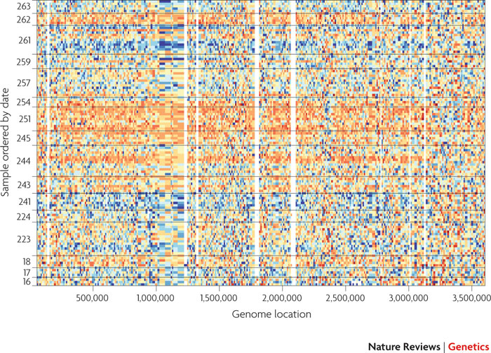

```{r style, echo = FALSE, results = 'asis'}
options(width=100)
knitr::opts_chunk$set(
    eval=as.logical(Sys.getenv("KNITR_EVAL", "TRUE")),
    cache=as.logical(Sys.getenv("KNITR_CACHE", "TRUE")))
```

```{r setup, echo=FALSE}
suppressPackageStartupMessages({
    library(ENAR2016)
    library(ggplot2)
    library(airway)
    library(DESeq2)
    library(org.Hs.eg.db)
    library(TxDb.Hsapiens.UCSC.hg19.knownGene)
    library(BSgenome.Hsapiens.UCSC.hg19)
    library(AnnotationHub)
})
```

# Introduction

## _R_

- [r-project.org][]: "A free software environment for statistical
  computing and graphics"

Functions

```{r}
rnorm(10)     # sample 10 random normal deviates
```

- zero or more arguments
- named or unnames `rnorm(10)` the same as `rnorm(n=10)`
- required or optional, e.g., `rnorm(n=10, mean=0, sd=1)`
- Help via `?rnorm`

Vectors

- logical (`c(TRUE, FALSE)`), integer (`1:5`), numeric (`rnorm(10)`),
  character (`c("alpha", "beat")`), complex
- statistical concepts: missing values (`NA`), factors
  (`factor(c("Female", "Male"))`), formulas (`y ~ x`)
- vectorized

```{r vectors}
x <- rnorm(1000)
y <- x + rnorm(1000)
plot(y ~ x)
```

Objects: classes and methods

- coordinated manipulation of related data
- simple _classes_, e.g., `data.frame()`, `matrix()`
- more complicated classes, e.g., `lm()`
- manipulation via _methods_

```{r classes}
df <- data.frame(Y = y, X = x)
fit <- lm(Y ~ X, df)
plot(Y ~ X, df)
abline(fit, col="red", lwd=2)
anova(fit)
```

Packages

- base & recommended
    - e.g., `stats`, `graphics`, `Matrix`
- contributed
    - e.g., `ggplot2`, `dplyr`, `ade`
    - discovery: [CRAN][] landing pages and task views
    - installation: `install.packages()` (or `biocLite()`, below)

```{r ggplot2, warning=FALSE}
library(ggplot2)
ggplot(df, aes(x=X, y=Y)) + geom_point() + geom_smooth(color="blue") +
    geom_smooth(method="lm", color="red")
```

Help!

- `help.start()`
- `?rnorm`
- `class(fit)`; `methods(plot)`; `methods(class=class(fit))`
- `?"plot<tab>...`

## _Bioconductor_

- [bioconductor.org][]: "Analysis and comprehension of high-throughput
  genomic data"

Biological domains

- Sequence analysis -- RNA-seq, ChIP-seq, SNPs, structural variants,
  ...
- Microarrays -- expression, methylation, copy number, ...
- Flow cytometry; proteomics; ...

Principles

- Interoperability

    - Formal approach to data -- 'S4' object system
    - Example: DNA sequences represented as a `DNAStringSet()`, rather
      than character vector.

- Reproducibility

    - Hallmark of scientific endeavor
    - Example: Package vignettes
    - Example: 'release' (bug fixes only; end user oriented) and
      'devel' (new features, new packages; developer playground)
      versions
    <!-- FIXME: Nature quote -->

Installation and use

- Discovery: [biocViews][], package landing pages (e.g., [DESeq2][])
- Installation: `biocLite("DESeq2")`; also works for CRAN & github
  packages
- Help! -- [support.bioconductor.org][]

## Sequence Analysis

Six stages

- Experimental design
- Wet-lab preparation
- Sequencing
- Alignment / Reduction
- Statistical analysis
- Comprehension


Key packages: data access

- [Biostrings][]: DNA sequences
- [ShortRead][]: FastQ
- [GenomicAlignments][] / [Rsamtools][]: BAM alignments
- [VariantAnnotation][]: VCF files
- [rtracklayer][]: BED, GFF / GTF, BigWig, ...


Coordinated management: [SummarizedExperiment][]

- Matrix of feature x sample assay(s)
- Column data descrbing samples
- Row ranges descrbing features

# Case Study: RNA-Seq Differential Expression

This is derived from: [RNA-Seq workflow][]: gene-level exploratory
analysis and differential expression, by Michael Love, Simon Anders,
Wolfgang Huber; modified by Martin Morgan, October 2015.

[RNA-Seq workflow]: http://bioconductor.org/help/workflows/rnaseqGene/

We walk through an end-to-end RNA-Seq differential expression
workflow, using [DESeq2][] along with other _Bioconductor_ packages.

The complete work flow starts from the FASTQ files, but we will start
after reads have been aligned to a reference genome and reads
overlapping known genes have been counted.

Our main focus is on differential gene expression analysis with
[DESeq2][]. Other _Bioconductor_ packages are important in statistical
inference of differential expression at the gene level, including
[Rsubread][], [edgeR][], [limma][], [BaySeq][], and others.

The data are from an RNA-Seq experiment of airway smooth muscle cells
treated with dexamethasone, a synthetic glucocorticoid steroid with
anti-inflammatory effects. Glucocorticoids are used, for example, in
asthma patients to prevent or reduce inflammation of the airways.

In the experiment, four primary human airway smooth muscle cell lines
were treated with 1 micromolar dexamethasone for 18 hours. For each of
the four cell lines, we have a treated and an untreated sample. The
reference for the experiment is:

Himes BE, Jiang X, Wagner P, Hu R, Wang Q, Klanderman B, Whitaker RM,
Duan Q, Lasky-Su J, Nikolos C, Jester W, Johnson M, Panettieri R Jr,
Tantisira KG, Weiss ST, Lu Q. "RNA-Seq Transcriptome Profiling
Identifies CRISPLD2 as a Glucocorticoid Responsive Gene that Modulates
Cytokine Function in Airway Smooth Muscle Cells." PLoS One. 2014 Jun
13;9(6):e99625.
PMID: [24926665](http://www.ncbi.nlm.nih.gov/pubmed/24926665).
GEO: [GSE52778](http://www.ncbi.nlm.nih.gov/geo/query/acc.cgi?acc=GSE52778).

## Preparation

Counts

- A feature x sample matrix of **raw** count data, typically counts of
  reads overlapping features
- Derived from sequence reads
- Via alignment and summarization (via [Rsubread][],
  [SummarizedExperiment][] `summarizeOverlaps()`, etc.)
- Directly from sequence data via *kallisto* or *sailfish*, using
  [tximport][] (in Bioc-devel, soon in release!)

[kallisto]: http://pachterlab.github.io/kallisto

`SummarizedExperiment`

```{r}
library(airway)
data("airway")
se <- airway
```

Assay data

- Features x samples
- Raw counts
- Row-wise tests

    ```{r}
    head(assay(se))
    ```

Experimental design

- Covariate (`cell`) plus treatment (`dex`)
- _R_'s formula interface allows for complicated designs, contrasts,
  etc

    ```{r}
    colData(se)
    design = ~ cell + dex
    se$dex <- relevel(se$dex, "untrt")     # 'untrt' as reference level
    ```

Features (genes)

- Genomic coordinates of gene models

    ```{r}
    rowRanges(se)
    ```

## Analysis Pipeline


Create `DESeqDataSet` object

```{r}
library(DESeq2)
dds <- DESeqDataSet(se, design = ~ cell + dex)
```

Run the pipeline

```{r}
dds <- DESeq(dds)
```

- Estimate size factors ('library size')
- Estimate dispersion coeficient of negative binomial model
- Fit GLM using negative binomial error
- Wald test

Summarize results

```{r}
res <- results(dds)
head(res)
mcols(res)                     # what does each column mean?
head(res[order(res$padj),])    # 'top table' by p-adj
```

## Some Considerations

### Experimental design

Keep it simple

- Classical experimental designs
- Time series
- Without missing values, where possible
- Intended analysis must be feasbile -- can the available samples and
  hypothesis of interest be combined to formulate a testable
  statistical hypothesis?

Replicate

- Extent of replication determines nuance of biological question.
- No replication (1 sample per treatment): qualitative description
  with limited statistical options.
- 3-5 replicates per treatment: designed experimental manipulation
  with cell lines or other well-defined entities; 2-fold (?)
  change in average expression between groups.
- 10-50 replicates per treatment: population studies, e.g., cancer
  cell lines.
- 1000's of replicates: prospective studies, e.g., SNP discovery
- One resource: [RNASeqPower][]

Avoid confounding experimental factors with other factors

- Common problems: samples from one treatment all on the same flow
  cell; samples from treatment 1 processed first, treatment 2
  processed second, etc.

Be aware of _batch effects_

- Known
    - Phenotypic covariates, e.g., age, gender
    - Experimental covariates, e.g., lab or date of processing
    - Incorporate into linear model, at least approximately
- Unknown
    - Or just unexpected / undetected
    - Characterize using, e.g., [sva][]
- Surrogate variable analysis
    - Leek et al., 2010, Nature Reviews Genetics 11
      [733-739](http://www.nature.com/nrg/journal/v11/n10/abs/nrg2825.html),
      Leek & Story PLoS Genet 3(9):
      [e161](http://dx.doi.org/10.1371/journal.pgen.0030161).
    - Scientific finding: pervasive batch effects
    - Statistical insights: surrogate variable analysis: identify and
      build surrogate variables; remove known batch effects
    - Benefits: reduce dependence, stabilize error rate estimates, and
      improve reproducibility
    - _combat_ software / [sva][] _Bioconductor_ package

  
  HapMap samples from one facility, ordered by date of processing.

### Wet-lab

Confounding factors

- Record or avoid

Artifacts of your _particular_ protocols

- Sequence contaminants
- Enrichment bias, e.g., non-uniform transcript representation.
- PCR artifacts -- adapter contaminants, sequence-specific
  amplification bias, ...

### Sequencing

Axes of variation

- Single- versus paired-end
- Length: 50-200nt
- Number of reads per sample

Application-specific, e.g.,

- RNA-seq, known genes: single- or  paired-end reads
- RNA-seq, transcripts or novel variants: paired-end reads
- ChIP-seq: short, single-end reads are usually sufficient
- Copy number: single- or paired-end reads
- Structural variants: paired-end reads
- Variants: depth via longer, paired-end reads
- Microbiome: long paired-end reads (overlapping ends)

### Alignment / Reduction

Alignment

- _de novo_
    - No reference genome; considerable sequencing and computational
      resources
- Genome
    - Established reference genome
    - Splice-aware aligners
    - Novel transcript discovery
- Transcriptome
    - Established reference genome; reliable gene model
    - Simple aligners
    - Known gene / transcript expression

Splice-aware aligners (and _Bioconductor_ wrappers)

- [Bowtie2](http://bowtie-bio.sourceforge.net/bowtie2) ([Rbowtie][])
- [STAR](http://bowtie-bio.sourceforge.net/bowtie2)
  ([doi](http://dx.doi.org/10.1093/bioinformatics/bts635))
- [subread](http://dx.doi.org/10.1093/nar/gkt214) ([Rsubread][])
- Systematic evaluation (Engstrom et al., 2013,
  [doi](http://dx.doi.org/10.1038/nmeth.2722))

Reduction to 'count tables'

- Use known gene model to count aligned reads overlapping regions of
  interest / gene models
- Gene model can be public (e.g., UCSC, NCBI, ENSEMBL) or _ad hoc_ (gff file)
- `GenomicAlignments::summarizeOverlaps()`
- `Rsubread::featureCount()`
- [HTSeq](http://www-huber.embl.de/users/anders/HTSeq/doc/overview.html),
  [htseq-count](http://www-huber.embl.de/users/anders/HTSeq/doc/count.html)

#### (Bowtie2 / tophat / Cufflinks / Cuffdiff / etc)

- [tophat](http://ccb.jhu.edu/software/tophat) uses Bowtie2 to perform
  basic single- and paired-end alignments, then uses algorithms to
  place difficult-to-align reads near to their well-aligned mates.
- [Cufflinks](http://cole-trapnell-lab.github.io/cufflinks/)
  ([doi](http://dx.doi.org/10.1038/nprot.2012.016)) takes _tophat_
  output and estimate existing and novel transcript abundance.
  [How Cufflinks Works](http://cole-trapnell-lab.github.io/cufflinks/papers)
- [Cuffdiff](http://cole-trapnell-lab.github.io/cufflinks/cuffdiff/)
  assesses statistical significance of estimated abundances between
  experimental groups
- [RSEM](http://www.biomedcentral.com/1471-2105/12/323) includes de
  novo assembly and quantification

#### (kallisto / sailfish)

- 'Next generation' differential expression tools; transcriptome
  alignment
- E.g., [kallisto](http://pachterlab.github.io/kallisto) takes a
  radically different approach: from FASTQ to count table without BAM
  files.
- Very fast, almost as accurate.
- Hints on
  [how it works](https://liorpachter.wordpress.com/2015/05/10/near-optimal-rna-seq-quantification-with-kallisto/);
  [arXiv](http://arxiv.org/abs/1505.02710)
- Integration with gene-level analyses --   [Soneson et al][].

    ```{r, eval=FALSE}
    ## in Bioc-devel

    library(tximportData)
    dir <- system.file("extdata", package="tximportData")
    samples <- read.table(file.path(dir,"samples.txt"), header=TRUE)
    files <- file.path(dir,"salmon", samples$run, "quant.sf")
    names(files) <- paste0("sample",1:6)

    # tx2gene links transcript IDs to gene IDs for summarization
    tx2gene <- read.csv(file.path(dir, "tx2gene.csv"))

    txi <- tximport(files, type="salmon", tx2gene=tx2gene)
    ```

# tx2gene links transcript IDs to gene IDs for summarization
tx2gene <- read.csv(file.path(dir, "tx2gene.csv"))

txi <- tximport(files, type="salmon", tx2gene=tx2gene)


[Soneson et al]: http://f1000research.com/articles/4-1521/v1

### Statistical Considerations

Unique statistical aspects

- Large data, few samples
- Comparison of each gene, across samples; _univariate_ measures
- Each gene is analyzed by the _same_ experimental design, under the
  _same_ null hypothesis

Summarization

- Counts _per se_, rather than a summary (RPKM, FPKM, ...), are
  relevant for analysis

    - For a given gene, larger counts imply more information; RPKM etc.,
      treat all estimates as equally informative.
    - Comparison is across samples at _each_ region of interest; all
      samples have the same region of interest, so modulo library size
      there is no need to correct for, e.g., gene length or mapability.

Normalization

- Libraries differ in size (total counted reads per sample) for
  un-interesting reasons; we need to account for differences in
  library size in statistical analysis.
- Total number of counted reads per sample is _not_ a good estimate of
  library size. It is un-necessarily influenced by regions with large
  counts, and can introduce bias and correlation across
  genes. Instead, use a robust measure of library size that takes
  account of skew in the distribution of counts (simplest: trimmed
  geometric mean; more advanced / appropriate encountered in the lab).
- Library size (total number of counted reads) differs between
  samples, and should be included _as a statistical offset_ in
  analysis of differential expression, rather than 'dividing by' the
  library size early in an analysis.
- Detail

    - [DESeq2][] `estimateSizeFactors()`, Anders and Huber,
      [2010](http://genomebiology.com/2010/11/10/r106)
    - For each gene: geometric mean of all samples.
    - For each sample: median ratio of the sample gene over the geometric
      mean of all samples
    - Functions other than the median can be used; control genes can be
      used instead

Appropriate error model

- Count data is _not_ distributed normally or as a Poisson process,
  but rather as negative binomial.
- Result of a combination Poisson (`shot' noise, i.e., within-sample
  technical and sampling variation in read counts) with variation
  between biological samples.
- A negative binomial model requires estimation of an additional
  parameter ('dispersion'), which is estimated poorly in small
  samples.
- Basic strategy is to moderate per-gene estimates with more robust
  local estimates derived from genes with similar expression values (a
  little more on borrowing information is provided below).

Pre-filtering

- Naively, a statistical test (e.g., t-test) could be applied to each
  row of a counts table. However, we have relatively few samples
  (10's) and very many comparisons (10,000's) so a naive approach is
  likely to be very underpowered, resulting in a very high _false
  discovery rate_
- A simple approach is perform fewer tests by removing regions that
  could not possibly result in statistical significance, regardless of
  hypothesis under consideration.
- Example: a region with 0 counts in all samples could not possibly be
  significant regradless of hypothesis, so exclude from further
  analysis.
- Basic approaches: 'K over A'-style filter -- require a minimum of A
  (normalized) read counts in at least K samples. Variance filter,
  e.g., IQR (inter-quartile range) provides a robust estimate of
  variability; can be used to rank and discard least-varying regions.
- More nuanced approaches: [edgeR][] vignette.

Borrowing information

- Why does low statistical power elevate false discovery rate?
- One way of developing intuition is to recognize a t-test (for
  example) as a ratio of variances. The numerator is
  treatment-specific, but the denominator is a measure of overall
  variability.
- Variances are measured with uncertainty; over- or under-estimating
  the denominator variance has an asymmetric effect on a t-statistic
  or similar ratio, with an underestimate _inflating_ the statistic
  more dramatically than an overestimate deflates the statistic. Hence
  elevated false discovery rate.
- Under the null hypothesis used in microarray or RNA-seq experiments,
  the expected overall variability of a gene is the same, at least for
  genes with similar average expression
- The strategy is to estimate the denominator variance as the
  between-group variance for the gene, _moderated_ by the average
  between-group variance across all genes.
- This strategy exploits the fact that the same experimental design
  has been applied to all genes assayed, and is effective at
  moderating false discovery rate.

## Comprehension: placing differentially expressed regions in context

- Gene names associated with genomic ranges
- Gene set enrichment and similar analysis
- Proximity to regulatory marks
- Integrate with other analyses, e.g., methylation, copy number,
  variants, ...


'Annotation' packages

- 'org': map between gene identifiers; also [GO.db][], [KEGGREST][]

    ```{r}
    library(org.Hs.eg.db)
    ttbl <- head(res[order(res$padj),])    # 'top table' by p-adj
    (ensid <- rownames(ttbl))
    mapIds(org.Hs.eg.db, ensid, "SYMBOL", "ENSEMBL")
    select(org.Hs.eg.db, ensid, c("SYMBOL", "GENENAME"), "ENSEMBL")
    columns(org.Hs.eg.db)
    ```
- 'TxDb'

    ```{r}
    ## gene models, organized by entrez identifier
    library(TxDb.Hsapiens.UCSC.hg19.knownGene)
    txdb <- TxDb.Hsapiens.UCSC.hg19.knownGene
    ## from Ensembl to Entrez identifiers
    egid <- mapIds(org.Hs.eg.db, ensid, "ENTREZID", "ENSEMBL")
    transcriptsBy(txdb, "gene")[egid]
    ```
- 'BSgenome': [BSgenome.Hsapiens.UCSC.hg19][]

    ```{r}
    library(BSgenome.Hsapiens.UCSC.hg19)
    genome <- BSgenome.Hsapiens.UCSC.hg19
    gn <- genes(txdb)[egid]
    up1000 <- flank(gn, width=1000)
    getSeq(genome, up1000)
    ```

- [AnnotationHub][]
    - Many consortium-scale resources
    - Cached on disk
    - Imported in appropriate format

    ```{r, eval=FALSE}
    library(AnnotationHub)
    hub = AnnotationHub()
    query(hub, c("ensembl", "gtf", "release-83"))
    hub["AH50417"]
    hub[["AH50417"]]
    ```

# Challenges & Solutions

## Interoperability: Standard Representations

Genomic Ranges: [GenomicRanges][]

- Standard representation of genomic coordiantes
- Describes annotations (exons, genes, transcripts, regulatory
  elements, ...) and data (peaks, reads, ...)
- A _ton_ of functionality, especially `findOverlaps()`

    ```{r}
    gr <- GRanges("chr1",
        IRanges(c(1000, 2000, 3000), width=100),
        strand=c("+", "-", "*"),
        score=c(10, 20, 30))
    gr
    ```

Data / metadata integration: [SummarizedExperiment][]

- Simple matrix, with more complicated row (feature) and column
  (sample) annotations.
- Very easy to coordinate data manipulation -- avoid those embarassing
  'off-by-one' and other errors!

    ```{r}
    library(airway)
    data(airway)
    airway
    ```

## Scalability

Efficient _R_ programming

- _R_ works best when functions are _vectorized_, i.e., operating on
  vectors rather than iterating.
      - n.b., `*apply()` are forms of _iteration_, not vectorization
- _R_ works best when memory is _pre-allocated_

- Worst: no pre-allocation, no vectorization; scales _quadratically_
  with number of elements

    ```{r}
    result <- integer()
    for (i in 1:10)
        result[i] = sqrt(i)
    ```

- Better: pre-allocate and fill; scales _linearly_ with number of
  elements, but at the _interpretted_ level

    ```{r}
    result <- integer(10)
    for (i in 1:10)
        result[[i]] = sqrt(i)
    ### same as the much more compact, expressive, and robust...
    result <- sapply(1:10, sqrt)
    ```

- Best: vectorize; scales linearly, but at the _compiled_ level so
  100x faster

    ```{r}
    result <- sqrt(1:10)
    ```

Restriction and 'chunk' iteration

- e.g., `ScanBamParam()`, `VcfParam()`
- e.g., `BamFile(..., yieldSize=1000000)`
- See also [GenomicFiles][]::`reduceByYield()`

    ```{r restriction}
    library(GenomicAlignments)
    file <- system.file("extdata", "ex1.bam", package="Rsamtools")
    aln <- readGAlignments(file)                   # all data
    length(aln)
    bamfile <- open(BamFile(file, yieldSize=1500)) # chunks
    length(readGAlignmens(file))                   # better: yieldSize=1e6
    length(readGAlignmens(file))
    length(readGAlignmens(file))
    length(readGAlignmens(file))
    ```

Parallel evaluation: [BiocParallel][]

- _After_ writing efficient _R_ code
- Very common paradigm: `lapply`-like
- Different 'back-ends', e.g., cores on a computer; computers in a
  cluster; instances in a cloud

    ```{r bioc-parallel}
    library(BiocParallel)
    system.time({
        res <- lapply(1:8, function(i) { Sys.sleep(1); i })
    })
    system.time({
        res <- bplapply(1:8, function(i) { Sys.sleep(1); i })
    })
    ```

- In _Bioc-devel_

    ```{r, eval=FALSE}
    X <- list(1, "2", 3)
    res <- bptry(bplapply(X, sqrt))
    X <- list(1, 2, 3)
    res <- bplapply(X, sqrt, BPREDO=res)
    ```

## Reproducibility: From Script to Package

Scripts

- ...Mature into re-usable functions
- 'Fit in your head'
- Poetry

Vignettes

- Like this document!
- Classic -- LaTeX-based
- Light weight / accessible: R-flavored markdown

        ---
        title: "A title"
        author: "An Author"
        vignette: >
          % \VignetteEngine{knitr::rmarkdown}
        ---

        # Heading

        ## Sub-heading

        Some text.

        ```{r r-code}
        x <- rnorm(1000)
        plot(x)
        ```

- Check out the [knitr][] package!

Packages

- Standard on-disk representation

        /MyPackage
        /MyPackage/DESCRIPTION
        /MyPackage/NAMESPACE
        /MyPackage/R/fun_one.R
        /MyPackage/R/fun_another.R
        /MyPackage/vignettes

- Very easy to create
- Very easy to share, e.g., github

# Acknowledgments

Individuals

- Current and recent team members: Valerie Obenchain, Herve Pages, Dan
  Tenenbaum, Jim Hester, Jim Java, Brian Long, Sonali Arora, Nate
  Hayden, Paul Shannon
- Technical Advisory Board: Vince Carey, Wolfgang Huber, Sean Davis,
  Michael Lawrence, Levi Waldron, Raphael Irizzary, Robert Gentleman
- Scientific Advisory Board: Simon Tavare, Robert Gentleman, Vince
  Carey, Raphael Irizzary, Wolfgang Huber, Simon Urbanek.

Annual conference: https://bioconductor.org/BioC2016

- Stanford, June 24 - 26
- Morning scientific lectures
- Afternoon workshops
- Social and other activities
- Space filling up!

```{r sessionInfo}
sessionInfo()
```


<br>

<br>

<br>

[r-project.org]: https://r-project.org
[CRAN]: https://cran.r-project.org
[bioconductor.org]: https://bioconductor.org
[biocViews]: https://bioconductor.org/packages/release/BiocViews.html#___Software
[support.bioconductor.org]: https://support.bioconductor.org
[Annual conference]: http://bioconductor.org/BioC2016
[DESeq2]: https://bioconductor.org/packages/DESeq2
[Biostrings]: https://bioconductor.org/packages/Biostrings
[ShortRead]: https://bioconductor.org/packages/ShortRead
[GenomicAlignments]: https://bioconductor.org/packages/GenomicAlignments
[Rsamtools]: https://bioconductor.org/packages/Rsamtools
[VariantAnnotation]: https://bioconductor.org/packages/VariantAnnotation
[rtracklayer]: https://bioconductor.org/packages/rtracklayer
[SummarizedExperiment]: https://bioconductor.org/packages/SummarizedExperiment
[Rsubread]: https://bioconductor.org/packages/Rsubread
[edgeR]: https://bioconductor.org/packages/edgeR
[limma]: https://bioconductor.org/packages/limma
[BaySeq]: https://bioconductor.org/packages/BaySeq
[tximport]: https://bioconductor.org/packages/tximport
[RNASeqPower]: https://bioconductor.org/packages/RNASeqPower
[sva]: https://bioconductor.org/packages/sva
[Rbowtie]: https://bioconductor.org/packages/Rbowtie
[GO.db]: https://bioconductor.org/packages/GO.db
[KEGGREST]: https://bioconductor.org/packages/KEGGREST
[org.Hs.eg.db]: https://bioconductor.org/packages/org.Hs.eg.db
[TxDb.Hsapiens.UCSC.hg19.knownGene]: https://bioconductor.org/packages/TxDb.Hsapiens.UCSC.hg19.knownGene
[BSgenome.Hsapiens.UCSC.hg19]: https://bioconductor.org/packages/BSgenome.Hsapiens.UCSC.hg19
[AnnotationHub]: https://bioconductor.org/packages/AnnotationHub
[GenomicRanges]: https://bioconductor.org/packages/GenomicRanges
[GenomicFiles]: https://bioconductor.org/packages/GenomicFiles
[BiocParallel]: https://bioconductor.org/packages/BiocParallel
[knitr]: https://cran.r-project.org/package=knitr
